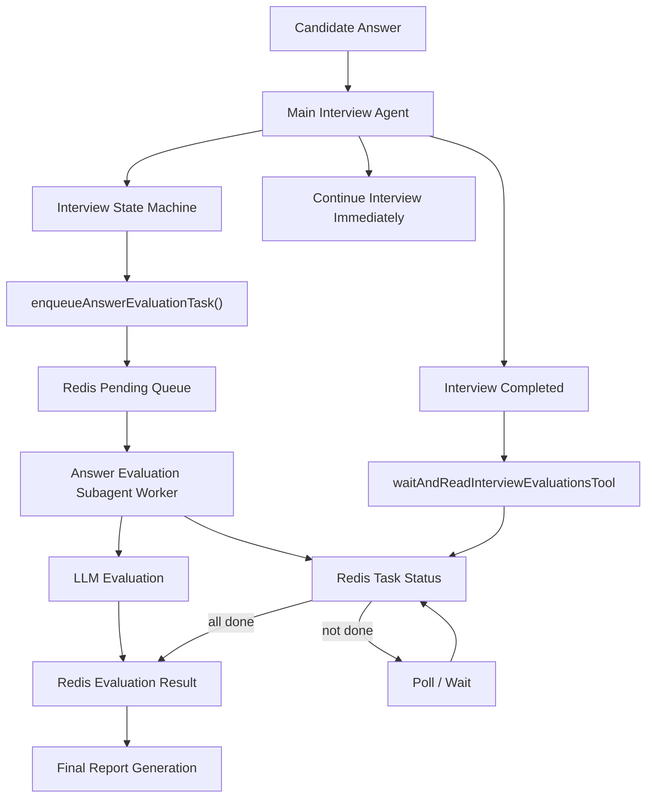
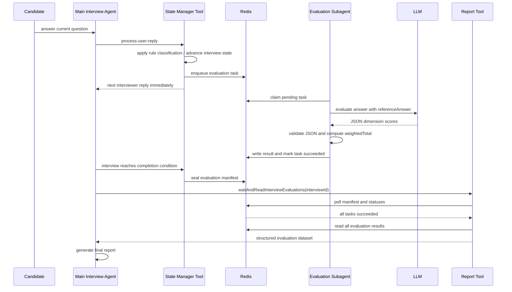

# Async LLM Answer Evaluation Subagent With Redis Plan

## Background

当前用户答题后的评分链路已经能把题库 `answer` 写入 topic node 的 `referenceAnswer`，并拆出 `evaluationPoints`。但当前评分仍主要由主面试 agent 的同步流程和规则兜底完成。新的目标是：

1. 主面试 agent 继续保持面试对话流畅，不被 LLM 评分阻塞。
2. 每次用户回答后，主流程只写入一个异步评估任务。
3. 独立 answer-evaluation subagent 异步消费任务、调用 LLM 评分，并把结果写入 Redis。
4. 面试结束生成 report 前，主 agent 必须通过 tool 等待当前 interview 的全部评估任务完成。
5. 只有所有评估任务完成后，report tool 才能读取 Redis 中的评估结果并生成最终报告。

## Goals

- 保持 `weightedTotal` 公式不变：

```ts
weightedTotal =
  relevance * 0.25 +
  accuracy * 0.25 +
  depth * 0.25 +
  specificity * 0.15 +
  clarity * 0.1;
```

- 五个维度分数由 LLM evaluator subagent 输出。
- 主面试 agent 不等待单题 LLM 评分完成。
- Redis 是异步任务、任务状态和评分结果的共享状态层。
- report 生成前必须等待全部评估任务完成。
- 保留现有规则评分作为 fallback 或临时 display，不作为最终 report 的唯一依据。

## Non-Goals

- 不在本计划中实现完整代码。
- 不改变主面试 agent 的提问节奏。
- 不把参考答案展示给候选人。
- 不改变最终 `weightedTotal` 计算方式。
- 不要求第一版支持分布式高吞吐队列；MVP 可以使用 Redis list / stream / sorted set 中最简单可测的一种。

## High-Level Architecture



## Core Data Schemas

### 1. Evaluation Task

每次用户回答后创建一条任务。任务应是不可变的 snapshot，避免后续状态机变化影响评分。

```ts
export const answerEvaluationTaskSchema = z.object({
  schemaVersion: z.literal(1),
  taskId: z.string(),
  interviewId: z.string(),
  threadId: z.string(),
  resourceId: z.string().optional(),
  nodeId: z.string(),
  roundId: z.string(),
  roundType: z.enum(['professional-skills', 'project-experience']),
  attemptId: z.string(),
  targetType: z.enum(['main-question', 'follow-up']),
  targetId: z.string(),
  targetRole: z.string(),
  responseLanguage: z.enum(['zh', 'en']),
  question: z.string(),
  mainQuestion: z.string(),
  followUpQuestion: z.string().optional(),
  referenceAnswer: z.string().optional(),
  evaluationPoints: z.array(z.string()).default([]),
  candidateAnswer: z.string(),
  nodeConversation: z.array(z.object({
    role: z.enum(['interviewer', 'candidate']),
    targetType: z.enum(['main-question', 'follow-up']),
    text: z.string(),
    createdAt: z.string(),
  })).default([]),
  createdAt: z.string(),
});
```

### 2. Evaluation Task Status

```ts
export const answerEvaluationTaskStatusSchema = z.object({
  schemaVersion: z.literal(1),
  taskId: z.string(),
  interviewId: z.string(),
  attemptId: z.string(),
  status: z.enum(['pending', 'running', 'succeeded', 'failed']),
  attempts: z.number().int().nonnegative(),
  createdAt: z.string(),
  startedAt: z.string().optional(),
  completedAt: z.string().optional(),
  lastError: z.string().optional(),
});
```

### 3. LLM Evaluation Result

LLM 只输出五维分数和结构化诊断，不输出 `weightedTotal`。`weightedTotal` 由代码按固定公式计算。

```ts
export const llmAnswerEvaluationResultSchema = z.object({
  schemaVersion: z.literal(1),
  taskId: z.string(),
  interviewId: z.string(),
  threadId: z.string(),
  nodeId: z.string(),
  roundId: z.string(),
  roundType: z.enum(['professional-skills', 'project-experience']),
  attemptId: z.string(),
  classification: z.enum([
    'direct-answer',
    'partial-answer',
    'deep-answer',
    'off-topic',
    'clarification-request',
    'skip-request',
    'stop-request',
    'meta-question',
  ]),
  score: z.object({
    relevance: z.number().min(0).max(10),
    accuracy: z.number().min(0).max(10),
    depth: z.number().min(0).max(10),
    specificity: z.number().min(0).max(10),
    clarity: z.number().min(0).max(10),
    weightedTotal: z.number().min(0).max(10),
  }),
  strengths: z.array(z.string()),
  missingPoints: z.array(z.string()),
  incorrectPoints: z.array(z.string()),
  evaluatorModel: z.string(),
  promptVersion: z.string(),
  createdAt: z.string(),
});
```

### 4. Interview Evaluation Manifest

用于 report 前判断“当前面试的所有评估任务是否完成”。

```ts
export const interviewEvaluationManifestSchema = z.object({
  schemaVersion: z.literal(1),
  interviewId: z.string(),
  threadId: z.string(),
  expectedTaskIds: z.array(z.string()),
  completedTaskIds: z.array(z.string()),
  failedTaskIds: z.array(z.string()),
  sealed: z.boolean(),
  sealedAt: z.string().optional(),
  updatedAt: z.string(),
});
```

说明：

- `expectedTaskIds`: 主 agent 每次写入任务时追加。
- `completedTaskIds`: subagent 成功写入结果后追加。
- `failedTaskIds`: subagent 最终失败后追加。
- `sealed`: 面试完成时设置为 `true`，表示不会再新增评估任务。
- report tool 只有在 `sealed === true` 且 `expectedTaskIds.length === completedTaskIds.length` 时读取结果。
- MVP 建议失败任务不允许直接生成 report，除非后续明确增加 fallback 策略。

## Redis Key Design

MVP 使用简单 key 约定，先不引入复杂队列系统。

```text
interview:{interviewId}:evaluation:manifest
interview:{interviewId}:evaluation:tasks
interview:{interviewId}:evaluation:task:{taskId}
interview:{interviewId}:evaluation:status:{taskId}
interview:{interviewId}:evaluation:result:{taskId}
answer-evaluation:pending
```

建议数据结构：

```text
answer-evaluation:pending
  Redis List or Stream
  value: taskId

interview:{interviewId}:evaluation:tasks
  Redis Set
  members: taskId

interview:{interviewId}:evaluation:task:{taskId}
  JSON string of AnswerEvaluationTask

interview:{interviewId}:evaluation:status:{taskId}
  JSON string of AnswerEvaluationTaskStatus

interview:{interviewId}:evaluation:result:{taskId}
  JSON string of LlmAnswerEvaluationResult

interview:{interviewId}:evaluation:manifest
  JSON string of InterviewEvaluationManifest
```

## LLM Evaluation Prompt Contract

### Prompt Inputs

```text
Target role:
{targetRole}

Round type:
{roundType}

Question:
{question}

Main question:
{mainQuestion}

Reference answer:
{referenceAnswer}

Reference answer points:
{evaluationPoints}

Candidate answer:
{candidateAnswer}

Node conversation:
{nodeConversation}
```

### Prompt Rules

```text
You are an answer evaluation subagent for a mock interview.
Return JSON only.
Do not reveal the reference answer.
Use the reference answer as guidance, not as a script.
Equivalent wording counts as covered.
Do not require exact phrasing.
Do not punish a candidate for giving a valid alternative explanation.
Only mark incorrectPoints when the candidate says something technically wrong.
Mark missingPoints for important gaps that matter for the asked question.
Score each dimension from 0 to 10:
- relevance: answer addresses the asked question and stays on topic.
- accuracy: technical correctness compared with reference answer and accepted equivalents.
- depth: mechanisms, trade-offs, edge cases, reasoning.
- specificity: concrete implementation details, project evidence, constraints, metrics.
- clarity: structure, readability, coherence.
```

### LLM Raw Output Shape

```ts
{
  classification: 'direct-answer' | 'partial-answer' | 'deep-answer' | 'off-topic',
  score: {
    relevance: number,
    accuracy: number,
    depth: number,
    specificity: number,
    clarity: number
  },
  strengths: string[],
  missingPoints: string[],
  incorrectPoints: string[],
  shouldAskFollowUp: boolean,
  followUpFocus: string[]
}
```

代码侧补齐：

```ts
weightedTotal =
  relevance * 0.25 +
  accuracy * 0.25 +
  depth * 0.25 +
  specificity * 0.15 +
  clarity * 0.1;
```

## Detailed Flow

### Runtime Sequence



## MVP Implementation Plan

### Step 1: Redis Evaluation Store MVP

目标：先实现最小 Redis 读写层，不接 LLM，不接主流程。

新增建议文件：

```text
src/mastra/lib/answer-evaluation-schemas.ts
src/mastra/lib/redis-evaluation-store.ts
```

最小能力：

- 写入 task。
- 写入 status。
- 写入 result。
- 读取 manifest。
- 更新 manifest 的 `expectedTaskIds` / `completedTaskIds`。
- seal manifest。

测试目标：

- `enqueueTask()` 后 Redis 中存在 task/status/manifest。
- `markSucceeded()` 后 manifest 的 `completedTaskIds` 包含 taskId。
- `sealManifest()` 后 `sealed === true`。

MVP 验收：

- 不需要启动 Mastra agent。
- 用 fake Redis 或 test Redis client 跑 unit test。
- schema parse 全部通过。

### Step 2: Main Agent Async Task Enqueue MVP

目标：用户答题后，主流程只负责创建评估任务，不等待 LLM。

改动位置：

```text
src/mastra/tools/interview-state-manager-tool.ts
src/mastra/lib/interview-state-machine.ts
```

最小能力：

- `applyUserReply()` 创建 `answerAttempt` 后，拿到：
  - `attemptId`
  - `nodeId`
  - `roundId`
  - `currentQuestion`
  - `referenceAnswer`
  - `evaluationPoints`
  - `candidateAnswer`
- 调用 `enqueueAnswerEvaluationTask()`
- enqueue 失败时只记录 warn，不阻塞主面试流程。

测试目标：

- process user reply 后，主流程仍返回下一题或追问。
- Redis 中新增一条 pending task。
- task snapshot 包含 `referenceAnswer/evaluationPoints/candidateAnswer`。
- Redis 写入失败时，`assistantReply` 仍正常返回。

MVP 验收：

- 主 agent 进度不依赖 subagent。
- 任务写入是 best-effort，但失败要有日志。

### Step 3: Evaluation Subagent Worker MVP

目标：创建独立 answer-evaluation subagent worker，异步消费 Redis pending queue。

状态：已完成 MVP（2026-06-07）。新增 `answer-evaluation-agent`、`answer-evaluation-runner`、`run-answer-evaluation-worker`，并注册 agent 到 Mastra runtime；可通过 `npm run worker:answer-evaluation` 单独启动 worker。

新增建议文件：

```text
src/mastra/agents/answer-evaluation-agent.ts
src/mastra/scripts/run-answer-evaluation-worker.ts
src/mastra/lib/answer-evaluation-runner.ts
```

最小能力：

- 从 Redis pending queue claim 一个 task。
- 将 status 从 `pending` 改为 `running`。
- 调用 LLM 生成 JSON。
- validate JSON。
- code 计算 `weightedTotal`。
- 写入 result。
- status 改为 `succeeded`。

测试目标：

- mock LLM 返回合法 JSON 时，worker 写入 result。
- result.score.weightedTotal 等于固定公式计算结果。
- prompt 中包含 reference answer，但 result 不包含完整 reference answer。
- status 流转：`pending -> running -> succeeded`。

MVP 验收：

- 可以通过脚本单独启动 worker。
- worker 不需要被主 Mastra agent 同步等待。

### Step 4: Worker Failure And Retry MVP

目标：让异步评分可靠，不因为一次 LLM 失败导致 report 永远等待。

最小能力：

- task status 记录 `attempts`。
- LLM JSON parse 失败或调用失败时重试。
- MVP 最大重试次数建议 3。
- 第 3 次失败后 status 改为 `failed`。
- manifest 记录 `failedTaskIds`。

关键策略选择：

```text
MVP strict mode:
  report tool 不接受 failedTaskIds，必须人工/系统重试成功后才能生成 report。

Future fallback mode:
  failed task 可以用当前规则评分 fallback result 兜底，但需要明确标记 evaluatorModel='fallback-rule'.
```

本计划建议 MVP 使用 strict mode，因为用户明确要求“必须要求子agent完成所有评估任务才可以读取”。

测试目标：

- mock LLM 连续失败 3 次后 status 为 `failed`。
- report wait tool 遇到 failed task 不返回 report data，返回 blocking/error 状态。
- 手动 retry failed task 成功后，report wait tool 可继续。

MVP 验收：

- 不会 silent fallback。
- 不会在失败任务存在时生成最终 report。

### Step 5: Wait-And-Read Report Tool MVP

目标：主 agent 在生成最终 report 前，通过 tool 等待所有异步评分完成。

新增建议文件：

```text
src/mastra/tools/interview-evaluation-report-tool.ts
```

输入：

```ts
z.object({
  interviewId: z.string(),
  threadId: z.string(),
  pollIntervalMs: z.number().default(1000),
  maxWaitMs: z.number().default(10000)
})
```

输出：

```ts
z.object({
  ready: z.boolean(),
  sealed: z.boolean(),
  expectedCount: z.number(),
  completedCount: z.number(),
  failedCount: z.number(),
  evaluations: z.array(llmAnswerEvaluationResultSchema),
  waitElapsedMs: z.number(),
})
```

等待规则：

```ts
while true:
  manifest = readManifest(interviewId)
  if !manifest.sealed:
    wait
  else if manifest.failedTaskIds.length > 0:
    return ready=false or throw strict blocking error
  else if completedTaskIds.length === expectedTaskIds.length:
    return all results
  else if elapsedMs >= maxWaitMs:
    return ready=false, blockingReason='timeout'
  else:
    wait
```

重要约束：

- report tool 不应该读取 partial result。
- report tool 不应该自己调用 LLM。
- report tool 不应该修改面试状态。
- report tool 最多等待 10 秒；超过 10 秒仍未 ready 时允许跳过本次 report 生成，不向用户展示 partial report。

测试目标：

- 未 sealed 时等待。
- sealed 但未完成时等待。
- sealed 且全部 completed 时返回所有 result。
- sealed 且存在 failed task 时不返回 report result。

MVP 验收：

- 可用 fake timer / mock Redis 做 deterministic test。
- 确认没有 partial report。

### Step 6: Final Report Generation Integration MVP

目标：面试完成时，不再只根据同步状态机 summary 生成最终报告，而是先读取 Redis 中全部 LLM 评估结果。

状态：已完成 MVP（2026-06-09）。主 state manager 在最后一题完成时会同步确保最后一条 evaluation task 写入 manifest，seal interview evaluation manifest，通过 wait/read 流程等待全部 Redis evaluation results；ready 后将 LLM evaluation result 按 `attemptId` 覆盖回 answer attempt，重算 node summary 和最终 report。若 manifest 缺失、expected task 数不足、存在 failed task 或等待超时，则不返回 partial report data，而是保持 wrap-up blocked 状态。

改动位置：

```text
src/mastra/tools/interview-state-manager-tool.ts
src/mastra/lib/interview-state-machine.ts
src/mastra/lib/interview-outcome.ts
```

最小能力：

- 面试完成时 seal manifest。
- 主 agent 调用 `waitAndReadInterviewEvaluationsTool`。
- 将 evaluations 映射到 node/attempt。
- report 使用 LLM evaluations 的：
  - score.weightedTotal
  - strengths
  - missingPoints
  - incorrectPoints
  - followUpFocus
- 现有 state summary 可作为展示 fallback，但最终 report 优先 Redis evaluation result。

测试目标：

- 有 2 个 answer attempts 时，report tool 必须读到 2 个 evaluation result。
- report 中的最终 score 来自 Redis result，而不是旧规则评分。
- 如果 Redis 还没完成，report 生成被阻塞等待。

MVP 验收：

- 单场 interview 的完整 report 使用异步 LLM 评估结果。
- 不泄露完整 reference answer。

### Step 7: E2E Smoke MVP

目标：验证完整闭环。

状态：已完成 deterministic smoke MVP（2026-06-09）。新增 `src/mastra/lib/async-answer-evaluation-e2e-smoke.test.ts`，使用 in-memory store 和 mock evaluator 覆盖 task enqueue、worker scoring、manifest seal、wait/read、final report 使用 LLM evaluation result 的闭环；live Docker/LLM E2E 仍可在完整本地服务环境下继续扩展。

测试场景：

```text
1. 初始化面试。
2. 用户回答第一题。
3. 主 agent 立即继续追问或下一题。
4. worker 异步完成第一题评分。
5. 用户完成所有题。
6. state manager seal manifest。
7. report tool 等待所有任务完成。
8. report 生成。
```

断言：

- 主流程在 worker 未完成时仍能继续。
- Redis 中每个 answer attempt 都有 task。
- 每个 task 都有 succeeded result。
- report tool 读取数量等于 manifest.expectedTaskIds.length。
- final report 中包含 LLM evaluation 的 missing points。
- final report 不包含完整 reference answer。

## Suggested Implementation Order

1. `answer-evaluation-schemas.ts`
2. `redis-evaluation-store.ts`
3. 单元测试 Redis store。
4. `interview-state-manager-tool.ts` enqueue task best-effort。
5. `answer-evaluation-agent.ts` 和 `answer-evaluation-runner.ts`。
6. worker 脚本 `run-answer-evaluation-worker.ts`。
7. worker success / failure / retry tests。
8. `interview-evaluation-report-tool.ts` wait-and-read。
9. report integration。
10. E2E smoke。

## Minimal Redis Store API

```ts
interface AnswerEvaluationStore {
  enqueueTask(task: AnswerEvaluationTask): Promise<void>;
  claimNextTask(): Promise<AnswerEvaluationTask | null>;
  markRunning(taskId: string): Promise<void>;
  markSucceeded(result: LlmAnswerEvaluationResult): Promise<void>;
  markFailed(taskId: string, error: string): Promise<void>;
  retryTask(taskId: string): Promise<void>;
  sealInterview(interviewId: string): Promise<void>;
  readManifest(interviewId: string): Promise<InterviewEvaluationManifest | null>;
  readResults(interviewId: string): Promise<LlmAnswerEvaluationResult[]>;
}
```

## Open Questions

### 已决策

- `interviewId` 直接使用 `threadId`，不再生成独立 session id。
- Redis 依赖由 root Mastra runtime 和 BFF 同时共享。BFF 可读取面试评估状态、展示等待/失败状态，Mastra runtime 负责写入任务、worker 消费任务和最终 report 前等待结果。
- Worker 采用常驻脚本模式，而不是 Mastra agent endpoint。Redis 队列中有评价任务时，常驻 worker 脚本消费任务并调用 `answer-evaluation-agent` 完成评分。
- 用户强制结束面试时，不为 `stop-request` answer attempt 创建评估任务。MVP 只评估真实答题 attempt。

### Strict Mode 说明

这里的 strict mode 指 report 生成策略：**只要某个真实答题 attempt 的异步 LLM 评分任务失败，最终 report 就不使用规则评分偷偷兜底，也不生成 partial report。**

例子：

```text
expectedTaskIds = ['task-1', 'task-2', 'task-3']
completedTaskIds = ['task-1', 'task-2']
failedTaskIds = ['task-3']
```

在 strict mode 下，report tool 不能读取 `task-1/task-2` 的结果后生成一个“看起来完整”的报告，因为 `task-3` 对应的真实回答没有 LLM 评分。它应该返回 blocked/failed 状态，或在 10 秒等待超时后跳过本次 report 生成。

与 strict mode 相对的是 fallback mode。fallback mode 会在 `task-3` 失败时使用本地规则评分生成 fallback result，例如：

```ts
{
  evaluatorModel: 'fallback-rule',
  score: existingRuleScore,
  missingPoints: existingRuleMissingPoints
}
```

当前 MVP 不采用 fallback mode，原因是用户明确要求最终报告必须依赖子 agent 完成的异步评分结果。后续如果产品上希望“即使 LLM 失败也展示报告”，再单独设计 fallback mode，并在 report 中明确标记哪些题是 fallback 评分。

### Failed Task 人工重试建议

MVP 可以提供一个内部维护入口或脚本，例如：

```bash
npm run retry:answer-evaluation -- --taskId answer-evaluation-answer-attempt-123
```

脚本逻辑：

```text
1. 读取 task/status/manifest。
2. 确认 status === 'failed'。
3. 将 status 改回 pending，保留 attempts 和 lastError。
4. 从 manifest.failedTaskIds 移除 taskId。
5. 将 taskId 重新 push 到 answer-evaluation:pending。
6. worker 再次消费并评分。
```

人工重试成功后：

```text
failedTaskIds: []
completedTaskIds: [..., taskId]
```

此时 report wait tool 才可以继续读取完整 evaluation dataset。

## Risks

### worker 不运行会导致 report tool 一直等待

处理策略：report tool 最大等待时间设为 10 秒。超过 10 秒仍未 ready 时，允许跳过本次 report 生成，不向用户展示 partial report。

状态约定：

```text
ready = false
blockingReason = 'timeout'
evaluations = []
```

### LLM JSON 不稳定会导致 failed task 增多

保证 JSON 稳定性的具体方案：

1. 使用 Mastra / model SDK 的 structured output 能力，传入 Zod schema，而不是只靠 prompt 说“返回 JSON”。
2. `temperature` 设为 0，降低输出随机性。
3. prompt 明确写 `Return JSON only`，禁止 markdown fence、解释文字、自然语言前后缀。
4. 输出 schema 尽量小而稳定：LLM 只输出 classification、五维分数、strengths、missingPoints、incorrectPoints、shouldAskFollowUp、followUpFocus；`weightedTotal` 由代码计算，不让 LLM 算。
5. 对原始输出做 `zod.parse`，失败就进入 retry，而不是尝试使用不可信结果。
6. retry 时可以追加更强的修复提示，例如“上次输出不是合法 JSON，这次必须只返回符合 schema 的 JSON object”。
7. 对数组长度做上限，例如 strengths/missingPoints/incorrectPoints 最多 5 条，避免模型输出过长导致截断或解析失败。
8. 对分数做范围约束和代码侧 clamp/validate，只接受 0 到 10。
9. 记录 raw parse error 和模型名，便于统计哪个模型或 prompt version 更容易失败。
10. 保持 prompt version，例如 `answer-evaluation-v1`，后续调 prompt 时可以对比失败率。

### Redis manifest 更新需要避免并发覆盖

这个风险指多个进程同时读写同一个 manifest 时，后写入的人可能覆盖先写入的人。

具体例子：

```text
初始 manifest:
expectedTaskIds = []
completedTaskIds = []

时间 T1:
主流程 A enqueue task-1，读取 manifest，看到 expectedTaskIds = []

时间 T2:
主流程 B enqueue task-2，也读取 manifest，看到 expectedTaskIds = []

时间 T3:
A 写回 expectedTaskIds = ['task-1']

时间 T4:
B 写回 expectedTaskIds = ['task-2']
```

最终 Redis 里只剩：

```text
expectedTaskIds = ['task-2']
```

`task-1` 被 B 的旧快照覆盖掉了。这样 report tool 会误以为只需要等 `task-2`，导致漏评。

另一个例子是 worker 成功写 completed 时：

```text
worker A 完成 task-1，准备写 completedTaskIds = ['task-1']
worker B 完成 task-2，准备写 completedTaskIds = ['task-2']
```

如果都是“读整个 JSON -> 本地改数组 -> set 整个 JSON”，最后可能只保留一个 completed task。

规避方案：

1. MVP 低并发时先接受当前实现，但在 report 前增加 expected task 数量校验，避免明显漏 task 时生成报告。
2. 更稳妥的实现是用 Redis Set 存 `expected/completed/failed`，例如：

```text
SADD interview:{id}:evaluation:expected task-1
SADD interview:{id}:evaluation:completed task-1
```

`SADD` 是原子操作，不会互相覆盖。

3. 如果仍保存 manifest JSON，则用 Redis transaction / WATCH：

```text
WATCH manifestKey
GET manifestKey
本地更新数组
MULTI
SET manifestKey newValue
EXEC
```

如果 `EXEC` 前 manifest 被别人改过，事务失败，当前进程重新读再写。

4. 对需要同时更新 status、result、manifest 的成功路径，可用 Lua script 保证一组写入原子完成。

### report tool 最大等待时间过短会出现用户看不到报告

产品决策：超过 10 秒看不到报告是允许的。系统不展示 partial report，也不使用完整 reference answer 或规则评分伪装成 LLM report。

### 完整 reference answer 写入 final report 会违反面试安全规则

处理策略：final report 必须移除完整 `referenceAnswer`。允许使用以下信息：

- LLM 输出的 strengths。
- LLM 输出的 missingPoints。
- LLM 输出的 incorrectPoints。
- 代码侧计算出的 score.weightedTotal。
- 经过抽象化的改进建议。

不允许输出：

- 完整 referenceAnswer 原文。
- 与 referenceAnswer 高度相似的逐句答案。
- “标准答案是……”这类可直接泄题的内容。

## MVP Completion Criteria

- 主面试流程不会等待单题评分。
- 每个真实 answer attempt 都有 Redis evaluation task。
- 独立 worker 能消费任务并写入 LLM evaluation result。
- report tool 在全部 task succeeded 前不会返回 evaluation dataset。
- final report 使用 Redis 中的 LLM evaluation result。
- `npm run build` 通过。
- 单元测试覆盖 schema、Redis store、worker、wait tool。
- E2E smoke 覆盖异步评分到 report 的闭环。
